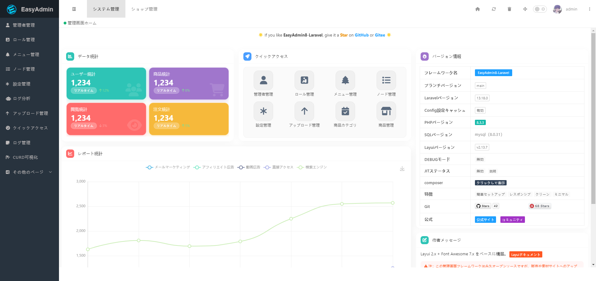

<div align="center" dir="auto">


<p>
<span></span>
<span></span>
<span></span>
<span></span>
<span></span>
<span></span>
</p>
</div>

## プロジェクト紹介

> `EasyAdmin8-Laravel-Japanese` は [`EasyAdmin8`](https://gitee.com/EasyAdmin8/EasyAdmin8) をベースに Laravel 13.x で再構築したプロジェクトです。PHP の最低バージョンは 8.3 以上です。
>
> 注意：このプロジェクトは `laravel 13.x` で構築されています。
>
> Laravel v13.x と layui v2.x を使用した、迅速な開発向けのバックエンド管理システムです。
>
> プロジェクトURL：[http://easyadmin8.top](http://easyadmin8.top)
>
> 【アクセスできない場合は、ローカル環境で構築して確認するか、下記の画面プレビューを参照してください】

## インストール手順

> EasyAdmin8-Laravel-Japanese は Composer で依存関係を管理しています。使用前に、マシンに Composer がインストールされていることを確認してください。

### `git` でパッケージをダウンロードし、`composer` で依存パッケージをインストールする場合

```
1. パッケージをダウンロード

  git clone https://github.com/EasyAdmin8/EasyAdmin8-Laravel-Japanese

2. 依存パッケージをインストール（PHP バージョン >= 8.3 を確認してください。ローカルアップロードが必要な場合は fileinfo 拡張をインストールしてください）

  ルートディレクトリで composer install を実行します。エラーが発生する場合は composer install --ignore-platform-reqs を使用できます。
  
3. .example.env ファイルを .env にコピーしてリネームします。コマンドは cp .example.env .env です。データベースのアカウントとパスワードを修正してください。

4. APP_KEY を設定します。コマンドは php artisan key:generate です。

5. コマンドで起動する（php artisan serve）か、擬似静的設定を行います（Nginx の例）
  
location / {
     try_files $uri $uri/ /index.php$is_args$query_string;  
}

```

## CURD コマンド一覧

> [CURD コマンド一覧](CURD.md) を参照してください。

## よくある質問

> [よくある質問](https://easyadmin8.top/guide/question.html) を参照してください。

## 画面プレビュー



## 関連ドキュメント

* [Laravel 13.x](https://laravel.com/docs/13.x)

* [EasyAdmin](http://easyadmin.99php.cn/docs)

* [Layui 2.x](https://layui.dev/docs)

* [Layuimini](https://github.com/zhongshaofa/layuimini)

* [Annotations](https://github.com/doctrine/annotations)

* [Jquery](https://github.com/jquery/jquery)

* [RequireJs](https://github.com/requirejs/requirejs)

* [CKEditor](https://github.com/ckeditor/ckeditor4)

* [Echarts](https://github.com/apache/incubator-echarts)

* [UEditorPlus](https://github.com/modstart-lib/ueditor-plus)

## 免責事項

> `EasyAdmin8-Laravel-Japanese` バックエンドフレームワークを使用する前に、本声明をよく読み、十分に理解してください。`EasyAdmin8-Laravel-Japanese` バックエンドフレームワークを使用しないことも選択できます。使用した時点で、本声明の全内容を承認し、受け入れたものとみなされます。

* `EasyAdmin8-Laravel-Japanese` に対応するライセンスに注意し、個人または企業で商用利用する場合は、ライセンスに従うか、対応する許可を取得してください。

* `EasyAdmin8-Laravel-Japanese` バックエンドフレームワークは、バックエンド管理をより便利に開発するためのオープンソースの高速開発フレームワークです。すべてのユーザーの個人プライバシーを尊重し保護し、ユーザーのコンピューター内の情報を窃取しません。また、ユーザーデータの保存などのネットワーク送信機能も備えていません。

* `EasyAdmin8-Laravel-Japanese` バックエンドフレームワークを合法かつ合理的な原則に基づいて使用することを約束してください。`EasyAdmin8-Laravel-Japanese` バックエンドフレームワークを違法行為、他者の正当な利益を侵害する悪意ある行為、または法令に違反する Web プラットフォームに使用しないでください。

* `EasyAdmin8-Laravel-Japanese` バックエンドフレームワークをダウンロードまたは使用したことにより発生した、あらゆる事故、過失、契約違反、名誉毀損、著作権または知的財産権侵害、およびそれに起因する損失（直接、間接、付随、派生的損失を含みますがこれらに限定されません）について、本オープンソースプロジェクトは一切の法的責任を負いません。

* ユーザーは、本声明条項に記載された全内容に明確に同意し、`EasyAdmin8-Laravel-Japanese` バックエンドフレームワークの使用に伴う可能性のあるリスクおよび関連する結果について、ユーザー自身がすべて負担するものとします。本オープンソースプロジェクトは一切の法的責任を負いません。

* 本免責事項を読んだ後、いかなる組織または個人も《MIT オープンソースライセンス》で許可された範囲内で、`EasyAdmin8-Laravel-Japanese` バックエンドフレームワークの公開、配布、使用などを合法的に行う必要があります。本免責事項の条項または法令に違反して発生した法的責任（民事賠償および刑事責任を含みますがこれらに限定されません）は、違反者自身が負担します。

* 本声明の一部が無効または執行不能と判断された場合でも、その他の部分は完全な効力を有します。執行不能な部分があることは、その声明を執行する権利を放棄するものではありません。

* 本オープンソースプロジェクトは、本声明条項および付属内容をいつでも一方的に変更する権利を有し、メッセージ通知や Web ページ公告などの方法で公表します。公表後、ただちに自動的に効力を生じ、別途個別通知は行いません。本声明内容の公告変更後も使用を継続する場合、変更後の声明内容を十分に読み、理解し、受け入れたものとみなされます。
